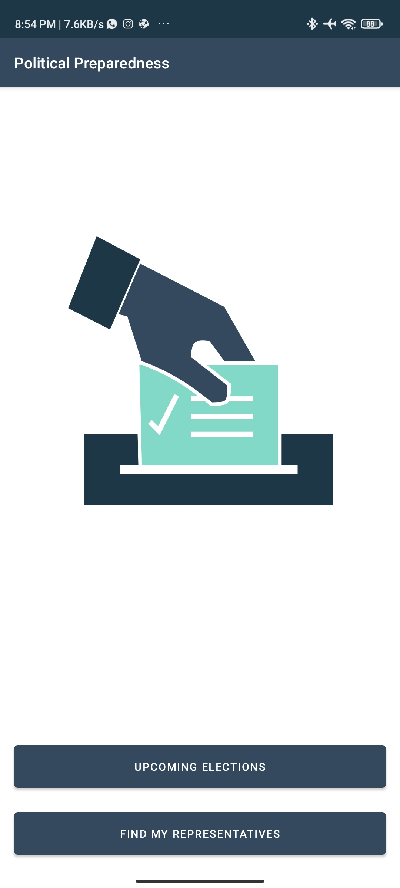
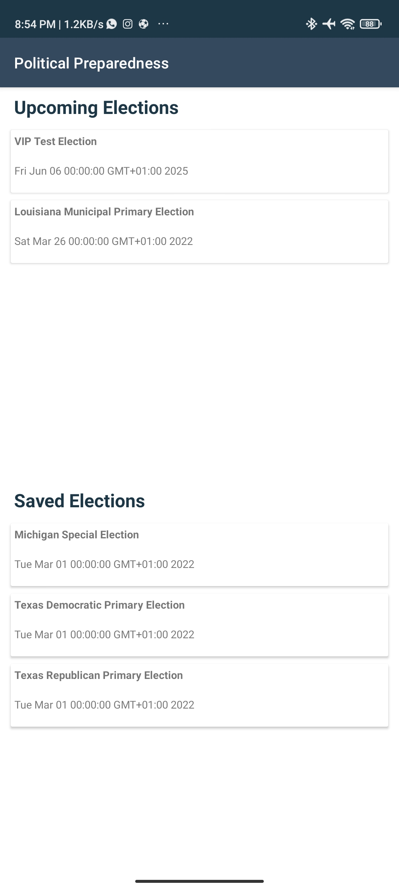
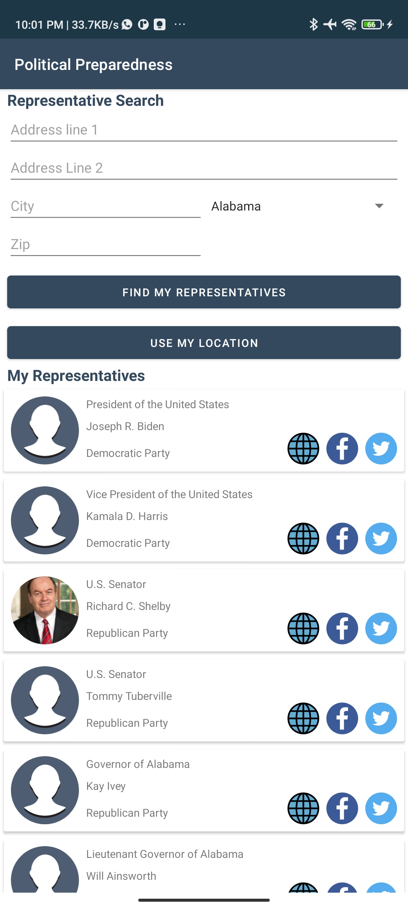

## Political Preparedness

PolitcalPreparedness is an example application built to demonstrate core Android Development skills as presented in the Udacity Android Developers Kotlin curriculum. 

This app demonstrates the following views and techniques:

* [Retrofit](https://square.github.io/retrofit/) to make api calls to an HTTP web service.
* [Moshi](https://github.com/square/moshi) which handles the deserialization of the returned JSON to Kotlin data objects. 
* [Glide](https://bumptech.github.io/glide/) to load and cache images by URL.
* [Room](https://developer.android.com/training/data-storage/room) for local database storage.
  
It leverages the following components from the Jetpack library:

* [ViewModel](https://developer.android.com/topic/libraries/architecture/viewmodel)
* [LiveData](https://developer.android.com/topic/libraries/architecture/livedata)
* [Data Binding](https://developer.android.com/topic/libraries/data-binding/) with binding adapters
* [Navigation](https://developer.android.com/topic/libraries/architecture/navigation/) with the SafeArgs plugin for parameter passing between fragments

## Prerequisite
To build this project, you require:
- Android Studio artic fox
- Gradle 7.0.4

## Screenshots
<h4 align="center">

	
	
## Author
Babatunde Owoleke

## License
This project is licensed under the Apache License 2.0 - See: http://www.apache.org/licenses/LICENSE-2.0.txt

## Report Issues
Notice any issues with a repository? Please file a github issue in the repository.
